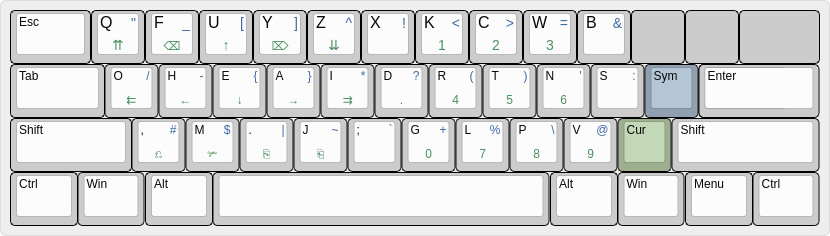

``3l`` - A better modifier based keyboard layout
================================================

**Three Layout**, more commonly called ``3l``, is an `alternative
keyboard layout`_ designed for efficiently typing both English text
and computer programs. ``3l`` is modifier based, so many of the keys
which would normally be accessed on the top row (with numbers on
QWERTY) can be accessed on the main part of the keyboard.

.. _`alternative keyboard layout`: https://en.wikipedia.org/wiki/Keyboard_layout#Non-QWERTY-based_Latin-script_keyboard_layouts

To give you an idea on how much this layout can improve your typing efficiency,
compare typing distance of George Orwell's *Nineteen Eighty-Four* to other
common layouts:

===================================================== =============
QWERTY                                                 10.4 miles
Neo 2.0                                                 6.3 miles
Antibracket (which this keyboard layout was based on)   6.3 miles
Dvorak                                                  6.2 miles
Colemak                                                 5.9 miles
Workman                                                 5.8 miles
WULY (my old layout)                                    5.6 miles
ARENSITO                                                5.3 miles
``3l``                                                **4.9 miles**
===================================================== =============

Typing distance is not the only factor that ``3l`` optimizes for. ``3l`` helps
**increase hand alternation**, **reduce bottom-to-top row jumps**, **decrease
lateral motion**, and also strives to be **easy to learn**.

See the ``docs`` directory for more images of the layout.

Testing the layout without installation
---------------------------------------

.. _applying the layout temporarily:

On Linux (using X or Wayland):

* **If you have xkeyboard-config 2.27 or later:** ``3l`` is already
  installed on your system. Just type ``setxkbmap us 3l`` or use your
  window manager's settings to adjust your layout.

* **If you have xkeyboard-config 2.26 or earlier:** clone this
  repository and run this command::

    setxkbmap 3l -print | xkbcomp -Ilinux/xkb - $DISPLAY

To return to QWERTY keyboard layout, type ``setxkbmap us``.

On Windows, compile and run the provided AHK script. Your keyboard layout will
return to normal when the script exits (in system tray). You may also
be interested in `toggling the layout`_.

On 9front, copy the file ``9front/3l`` to ``/sys/lib/kbmap/3l``. You can use ``kbmap(1)`` to switch between layouts.

Installation
------------

Linux
~~~~~

To set ``3l`` as the *default keyboard layout* for your system, add a
section to your X11 configuration::

    $ cat /etc/X11/xorg.conf.d/99-keyboard.conf
    Section "InputClass"
            Identifier "system-keyboard"
            MatchIsKeyboard "on"
            Option "XkbLayout" "us"
            Option "XkbVariant" "3l"
    EndSection

``systemd`` has the ``localectl`` utility that you may optionally use
to maintain this configuration file.

.. admonition:: If you don't have xkeyboard-config 2.27 or later

   Place the ``linux/xkb/symbols/3l`` file in your system's
   ``symbols`` directory. This is typically something like
   ``/usr/share/X11/xkb/symbols``. You'll need the configuration to
   look a little different::

        $ cat /etc/X11/xorg.conf.d/99-keyboard.conf
        Section "InputClass"
                Identifier "system-keyboard"
                MatchIsKeyboard "on"
                Option "XkbLayout" "3l"
        EndSection

Mac OS X [2]_
~~~~~~~~~~~~~

1. Install `Karabiner Elements`_
2. Copy the ``macosx/karabiner.json`` file to the ``~/.config/karabiner/``
   directory.
3. Select the ``3l`` profile from Karabiner Elements.

.. [2] Get off your hipster butt. This can be used to refer to "OS X" and
       "macOS" as well.
.. _`Karabiner Elements`: https://github.com/tekezo/Karabiner-Elements

Windows
~~~~~~~

There are two implementations of ``3l`` for Windows, a simple
AutoHotkey_ script located in this repository, and the more advanced
ReNeo_ also offers a configuration for ``3l``.  Depending on your
needs, you may want to check out the ReNeo driver for advanced
customization options.

AutoHotkey
^^^^^^^^^^

Place the AHK script in your "Startup" folder.

.. _toggling the layout:

To toggle between ``3l`` and your system layout (e.g., QWERTY), press
both ``Alt`` keys at the same time.

ReNeo
^^^^^

See the ReNeo_ repository for install instructions.

.. _AutoHotkey: https://www.autohotkey.com/
.. _ReNeo: https://github.com/Rojetto/ReNeo

9front
~~~~~~

Copy the file ``9front/3l`` to ``/sys/lib/kbmap/3l``. You can toggle the layout with ``kbmap(1)``.

To set the layout on boot, add it to your ``plan9.ini(8)``::

        % 9fs 9fat
        % cat /n/9fat/plan9.ini
          ...
          kbmap=3l
          ...
        % unmount /n/9fat

Ensure that the file ends in a newline. You will also need to rebuild your kernel, following the instructions under `FQA 5`_.

.. _FQA 5: http://fqa.9front.org/fqa5.html

Frequently Asked Questions
--------------------------

**What happens if I have to use someone else's computer and all
they've got is QWERTY?**

Short-term use of someone's computer with QWERTY is usually a
non-concern. Since most keyboards have the layout printed on the
key caps, most users of ``3l`` don't have any issues surviving.

For long-term use (such as on a shared machine, or a school lab
computer), `applying the layout temporarily`_ usually only takes a few
minutes to setup and can help relieve some pains.

**What happens if someone has to temporarily use my computer?**

For Windows, see `toggling the layout`_.

For Linux, most window managers provide a convenient way to toggle
between layouts. If your window manager does not have that, just bind
a key to run ``setxkbmap``.

If anyone has some Mac OS X tips, please submit a PR. (I presume
Karabiner makes this pretty easy.)

For 9front, use ``kbmap(1)`` to switch layouts.

**How should I start learning?**

The `Klavaro Typing Tutor`_ is configurable to multiple layouts (you
can put in ``3l`` as a custom layout) and is an excellent option for
learning. You should start with the basic skills courses before the
speed-typing courses.

.. _Klavaro Typing Tutor: http://klavaro.sourceforge.net/

Most users will recommend going `cold turkey`_ from your old layout
when just starting to learn. This will help you focus on your
learning, and `learning survival QWERTY`_ later is always an option.

.. _cold turkey: https://en.wikipedia.org/wiki/Cold_turkey

**How long does it take to learn?**

Most users are able to accomplish survival typing skills (>20 WPM)
within one week of starting to learn. Focusing on accuracy over speed
during your first few weeks of learning will help you be successful,
and you'll pick up the speed in the long run.

**Will I forget QWERTY?**

.. _learning survival QWERTY:

Most users seem to indicate that they lost some QWERTY skills while
re-training their brain to ``3l``, but were eventually able to recover
enough skills to survive in the long term.

**Will I type faster than on my old layout?**

Maybe. While most users report they are able to type faster than they
could on QWERTY, the primary benefit of trying an alternative layout
is in typing comfort and health. Many users enjoy reduced repetitive
motions, and find typing longer hours less difficult.

**Will I have to re-configure my text editor for the new layout?**

``3l`` was designed partly with keeping vanilla Vi-style keybindings
somewhat sane in mind. If you find yourself using many systems and
don't want to have to keep configuration in sync, you'll appreciate
how easy it is to use Vi or Vim style editors with the default
configuration. I personally use Emacs with `Evil mode`_, and haven't
had any issues keeping most of the Vi-style bindings in their standard
configuration. That being said, if you find that some sort of
rebinding with respect to ``3l`` helps you, I'm curious to see what
you've done. Maybe we can drop this in some sort of ``contrib/``
directory.

.. _Evil mode: https://www.emacswiki.org/emacs/Evil

I'm curious to hear if and what people do to work with ``3l`` and
non-Vi editors. Drop me an email or a PR :)

**Is the symbols layer designed for a specific programming language?**

The symbols layer is mostly derived from the Neo 2.0 keyboard layout,
and to the best of my knowledge, was not designed with any specific
programming language in mind. I've used it with everything from
C-style languages, to HTML, to Haskell, to Python, and Lisp and have
found that most every language benefits from the symbols layer.

**What about using the layout on mobile?**

Modern mobile keyboards (such as Gboard_) tend to use machine learning
algorithms for predictive input and autocorrect, and these algorithms
were trained on QWERTY users. In addition, QWERTY's design of common
bigraphs spaced far apart is incidentally a helpful design when using
swipe typing. For these reasons, nobody has bothered with making a
moblie version.

.. _Gboard: https://en.wikipedia.org/wiki/Gboard

However, an Android or iOS version of the layout could potentially be
useful for tablet typing. If someone with expertise in this domain
wanted to implement this and submit a PR, that would be very much
appreciated.

Community
---------

Matrix Room
~~~~~~~~~~~

Join our Matrix chat room at `#threelayout:ohea.xyz`_.

.. _#threelayout:ohea.xyz: https://matrix.to/#/#threelayout:ohea.xyz

Mailing List
~~~~~~~~~~~~

There is an email list for general chat about the layout. Please
`subscribe`__ to the list. You can send mail to the list using the
address::

  3l-users@googlegroups.com

You do not have to be a member to post, so feel free to reach out on
this list with questions about the layout, even if you're not a user
yet.

__ https://groups.google.com/forum/#!forum/3l-users

Users' Registry
~~~~~~~~~~~~~~~

This section lists people who have learned to type on ``3l``. Users who learn
to type at least 15 WPM (that's what it takes to get past the initial learning
threshold) on ``3l`` can be added to this list. This list is included here so
you can query typists to see what they like and dislike about the layout before
you dedicate time to learning, or so you can reach out for learning tips.

* `Jack Rosenthal`__ (Me, who created ``3l`` in the Fall of 2015)
* `Josh Hoffer`__ (who learned ``3l`` in the Spring of 2017)
* `Sumner Evans`__ (who learned ``3l`` in the Spring of 2017)
* `Robert Zampino`__ (who learned ``3l`` in the Spring of 2018)
* `Patrick Nichols`__ (who learned ``3l`` in the Fall of 2018)
* `David Florness`__ (who learned ``3l`` in the Fall of 2018)
* `Daichi Jameson`__ (who learned ``3l`` in the Fall of 2018)
* `Jesus Nunez`__ (who learned ``3l`` in the Fall of 2018)
* `Liam Warfield`__ (who learned ``3l`` in the Spring of 2019)
* `Sam Warfield`__ (who learned ``3l`` in the Summer of 2019)
* `Sam Sartor`__ (who learned ``3l`` in the Summer of 2019)
* `Peter Rosenthal`__ (who learned ``3l`` in the Spring of 2020)
* `Sean Gillespie`__ (who learned ``3l`` in the Spring of 2020)
* `Uladzislau Khamkou`__ (who learned ``3l`` in the Fall of 2021)
* `Samuel Clay`__ (who learned ``3l`` in the Spring of 2022)

__ http://inside.mines.edu/~jrosenth
__ https://github.com/JoshH100
__ https://github.com/sumnerevans
__ https://github.com/robozman
__ https://github.com/panichol
__ https://github.com/edwargix
__ https://github.com/daichij
__ https://github.com/jnunez101
__ https://github.com/liamwarfield
__ https://github.com/Warfields
__ https://samsartor.com/
__ https://github.com/peterrosenthal
__ https://github.com/sgillespie
__ https://github.com/hvod2000
__ https://github.com/olivethepuffin

If you learn the layout, feel free to submit a PR with your name added.
